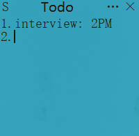

# Todo 
 It's a concise tool which you can use to replace windows notebook if you don't need many extra functions other than text recording.

## Install
 - Download the packaged file in release.
 - Build your own using source code.

## Usage
 - Texting any plan or schedule.
 - Change window size by click the icon in the upper left corner.
 - Modify basic setting by click the ··· in the upper right corner.

 

## Todo
 - beautify window
 - support hotkey
 - Adjustable font size

## Maintainer

## License

[MIT](https://github.com/RichardLitt/standard-readme/blob/master/LICENSE) © Shem

## Reference

https://blog.csdn.net/weixin_48448842/article/details/116349627